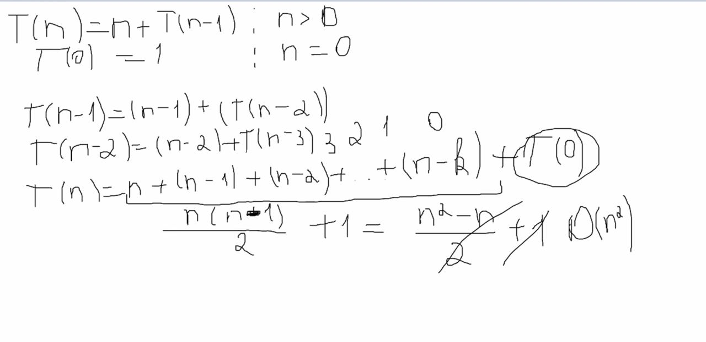
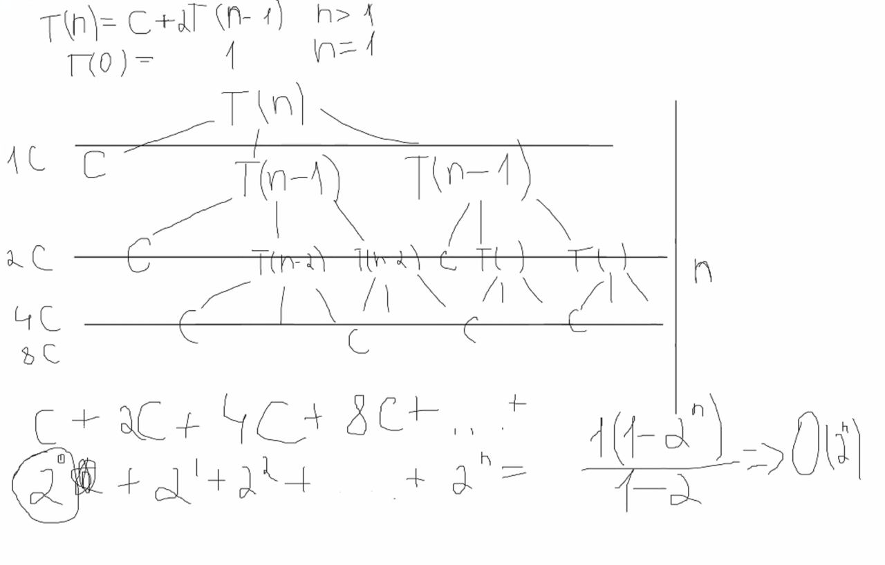
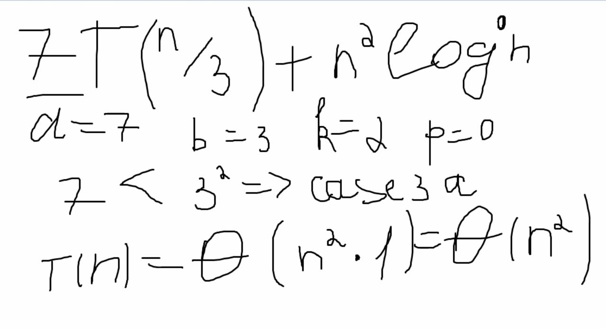
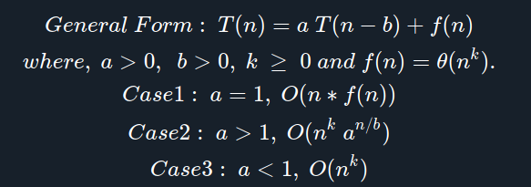
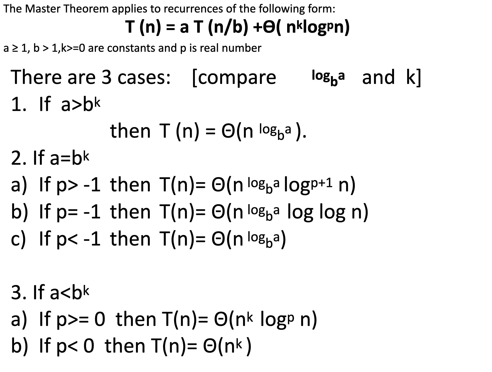
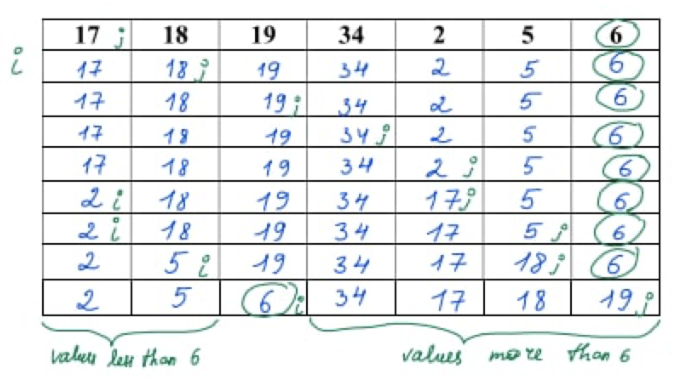
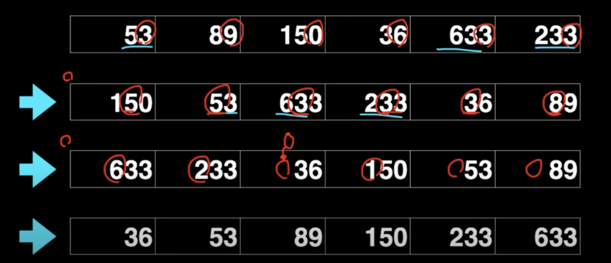
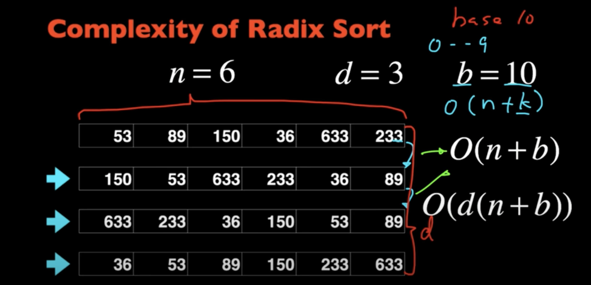
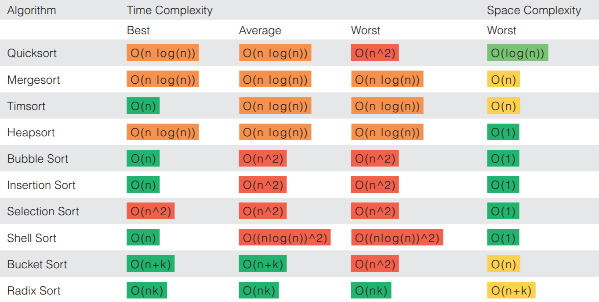

# Computer Algorithms

Rustam Zokirov • Sep 19, 2021

## Table of contents
- [Introduction](#introduction)
- [Data Abstraction](#data-abstraction)
- [Asymptotic Notations](#asymptotic-notations)
    - [Practice 1](#practice-1)
- [Analyzing Recurrences](#analyzing-recurrences) - running time of **recursive program** code
- [Master's Theorem](#masters-theorem)
- Insertion sort
- Merge sort
- [Heap sort](#heap-sort)
- [Quick sort](#quick-sort)
- [Radix sort](#radix-sort)
- Bucket sort
- [RedBlack Tree](#redblack-tree)

## Introduction
- A **computer algorithm** is 
    - a detailed step-by-step method
    - for solving a problem
    - by using a computer
- **Properties**
    - Finiteness (should be terminated)
    - Unambiguous (must be clear)
    - Definiteness of sequence (by order)
    - Input /Output defined
    - Feasibility (must be possible to implement)
- **Problem solving strategies**
    - Divide & Conquer
    - Greedy Method (making the most possible solution)
    - Branch & Bound 
    - Backtracking
    - Dynamic Programming
    - Brute Force (checking all possibilities)
    - Randomized  


## Data Abstraction
- Abstact Data Type - each ADT has set of *values* and *operations*
- Encapsulation: hide implementation details
    - A data structure is the physical implementation of an ADT
- **Data items have both *logical* and *physical* form**
    - Logical form: definition of the data item within an ADT. 
    - Physical form: implementation of the data item within a data structure
- Abstract Data Types
    - Lists, Trees
    - Stacks, Queues
    - Priority Queue, Union-Find
    - Dictionary
- **ADT Specification**
    - Specification formally define the behavior of a software system or a module (*in terms of Inputs and Outputs*)
    - A specification of an operation consists of:
        - Calling prototype
        - Preconditions
        - Postconditions
    - The calling prototype includes 
        - name of the operation
        - parameters and their types
        - return value and its types
    - The preconditions are statements 
        - assumed to be true when the operation is called
    - The postconditions are statements 
        - assumed to be true when the operation returns.


## Asymptotic Notations
- Running time of an algorithm as a function of input size **n for large n**
- O (worst, upper bound), Ω (best, lower bound), Θ (average, tight bound)
- “Running time is O(f(n))” -> Worst case is O(f(n))
- “Running time is Ω(f(n))” -> Best case is Ω(f(n))

### Practice 1
```
Big O
__________________________________________________________________
a. f(n) = 5n^3 + n^2 + 6n + 2
5n^3 + n^2 + 6n + 2 <= 5n^3 + n^2 + 6n + n      n >= 2
                    <= 5n^3 + n^2 + 7n  
                    <= 5n^3 + n^2 + n^2         n^2 >= 7n, n >= 7
                    <= 5n^3 + 2n^2 
                    <= 5n^3 + n^3               n^3 >= 2n^2, n >= 2
                    <= 6n^3
                    = O(n^3)
                    [c=6, n>=7]

b. f(n) = 6n^2 + 3n + 2^n
2^n + 6n^2 + 3n <= 2^n + 6n^2 + n^2             n^2 >= 6n, n >= 6
                <= 2^n + 7n^2
                <= 2^n + 2^n                    2^n >= n^2, n >= 4 
                <= 2*2^n 
                = O(2^n)
                [c=2, n=6]

Big Ω
__________________________________________________________________
a. 5n^3 + n^2 + 3n + 2
5n^3+ n^2 + 3n + 2 >= 5n^3      n0 >= 1
                    = Ω(n^3)
                    [c=5, n0>=1]

b. 4*2^n + 3n
4*2^n + 3n >= 4*2^n     n0 >= 1
            = Ω(2^n)
            [c=4, n0 >= 1]

Big Θ (average)
__________________________________________________________________
a. f(n) = 27*n^2 + 16n
27*n^2+16n <= 27*n^2+n^2    n^2 >= 16n, n >= 16
           <= 28*n^2
            = O(n^2)
            [c1=28, n0=16]

27*n^2+16n >= 27*n^2        n0 >= 1
            = Ω(n^2)
            [c2=27, n0>=1]

Overall, [c1=28, c2=27, n0>=16]

b. f(n) = 3*2^n + 4n^2 + 5n + 2
3*2^n+4n^2+5n+2 <= 3*2^n+4n^2+5n+n      n >= 2
                <= 3*2^n+4n^2+6n
                <= 3*2^n+4n^2+n^2       n^2 >= 6n, n >= 6
                <= 3*2^n+5n^2
                <= 3*2^n+2^n            2^n >= n^2, n >= 4
                <= 4*2^n
                = O(2^n)
                [c1=4, n0>=6]

3*2^n + 4n^2 + 5n + 2 >= 3*2^n      n0 >= 1
                      = Ω(2^n)
                      [c2=3, n0>=1]

Overall, [c1=4, c2=3, n0>=6]

Extra 
__________________________________________________________________
f(n) = 5n^3 + 2 and g(n)= n^2

a. g(n) = o f(n)
n^2 = o(5n^3 + 2)
n^2 = o(n^3) TRUE

b. f(n) = O g(n)
5n^3 + 2 = O(n^2) FALSE, it should be at least O(n^3), O(n^4)
```

## Analyzing Recurrences
- Back substitution
- Recursive tree method
- Master's theorem

```
// T(n) = n + T(n-1) => O(n^2) 
demo(int n){ 
    if(n>0){
        for(i=1; i<=n; i++) // this 
            print (“message”);
        demo(n-1);          // and this
    }
    else
    return 1;
}

// T(n) = logn + T(n-1)	=> 0(nlogn)
demo(int n){ 
 if(n>0){
      for(i=1; i<=n; i=i*2) // logn because of i*2
          print (“message”);
      demo(n-1);            // and this
   }
else
return 1;
}

// T(n) = 2T(n-1) + c => 0(2^n)
demo(int n){ 
 if(n>0){
      print (“message”); // we don't have for loop
      demo(n-1); // 2T(n-1) comes from two recursive funcs
      demo(n-1);
   }
else
return 1;
}

// T(n) = T(n/2) + c => 0(logn)
demo(int n){ 
 if(n>1){
      print (“message”);
      demo(n/2);
     }
else
return 1;
}

// O(n) because [n + T(n/2) = n]
demo(int n){ 
 if(n>1){
	for(i=1; i<=n; i=i+1)    
	print (“message”);
      	demo(n/2);
    }
else
return 1;
}
// 2T(n/2)+n which is nlogn, when there are 2 times demo(n/2)


T(n) = c + T(n-1)		=> 0(n)
	 = 1 + T(n-1)		=> 0(n)
	 = n + T(n-1)		=> 0(n^2)
	 = n^2 + T(n-1)	    => 0(n^3)
	 = logn + T(n-1)	=> 0(nlogn)

T(n) = 2T(n-1) + c	    => 0(2^n)
	 = 3T(n-1) + 1	    => 0(3^n)
	 = 2T(n-1) + n	    => 0(n2^n)
	 = 2T(n-1) + logn	=> 0(logn * 2^n)
```

- Back substitution <br>

- Recursive tree method (use geometric progression sum formula a(1-r^n)/(1-r) ) <br>

- Master's Theorem <br>



## Master's Theorem




## Heap Sort
- `build_max_heap()` - build max heap from unsorted array
- `max_heapify()`
- `extract_max_heap()`
- How to do: take the max number put it about, then do heapify for both children. Take the root node, and swap with the rightmost leaf child. Then delete root node after swap which is now in the leaf. Then again apply heapify, and extract max heap for whole array.

## Quick sort


## Radix sort
https://www.youtube.com/watch?v=XiuSW_mEn7g

How it works?

We take the last digit of an element, then sort by it, then we move to another digit, and again sort by them.




## Bucket sort
https://www.youtube.com/watch?v=NvZG0dZ60RQ

We have an array, just put the same values into one bucket. Then place back again. Only in range of 0-999, and these values already created for us.


## RedBlack Tree
- https://www.youtube.com/watch?v=A3JZinzkMpk&list=PL9xmBV_5YoZNqDI8qfOZgzbqahCUmUEin&index=4
- Case 1: Z.uncle = red --> recolor(all)
- Case 2: Z.uncle = black(triangle) --> rotate Z.parent # just put child(z) above its parent, this will bring case 3
- Case 3: Z.uncle = black(line) --> rotate(Z.grandparent) # parent will be root, + recolor(parent, grandparent)
- O(logn)

### Complexity

