# Data Structures and Computer Algorithms
Lecture notes on Data Structures `SOC-2010` and Computer Algorithms `SOC-3030`

By Rustam Zokirov • Fall Semester 2020 • Fall Semester 2021

> *NOTES ON COMPUTER ALGORITHMS - [HERE](Computer_Algorithms.md)*

## Learning roadmap
- [ ] START HERE: [Naso Academy DS playlist](https://www.youtube.com/playlist?list=PLBlnK6fEyqRj9lld8sWIUNwlKfdUoPd1Y)
- [ ] [The Last Algorithms Course You'll Need](https://frontendmasters.com/courses/algorithms/introduction/)
- [ ] ALGORITHMS VIDEO: [Jenny's DSA playlist](https://www.youtube.com/playlist?list=PLdo5W4Nhv31bbKJzrsKfMpo_grxuLl8LU)
- [ ] READING: [programiz.com/dsa](https://www.programiz.com/dsa)
- [ ] SHORT VIDEOS: [Data Structures by Google Software Engineer](https://www.youtube.com/playlist?list=PLDV1Zeh2NRsB6SWUrDFW2RmDotAfPbeHu)

## Contents
- [Introduction to Data Structures](#introduction-to-data-structures)
    - [Introduction](#introduction)
    - [Abstract Data Type](#abstract-data-type)
    - [Asymptotic Notations (O, Ω, Θ)](#asymptotic-notations)
- [Searching techniques](#searching-techniques)
    - [Linear Search](#linear-search)
    - [Binary Search](#binary-search)
- [Sorting techniques](#sorting-techniques)
  - [Merge sort](#merge-sort)
  - [Quick sort](#quick-sort)
  - [Heap sort](#heap-sort)
- [Linked list](#linked-list)
    - [Insertion at the beginning](#insertion-at-beginning-in-linked-list)
    - [Insertion at the end](#insertion-at-the-end-in-linked-list)
    - [Insertion at particular position](#insertion-at-particular-position)
    - [Deleting the first Node](#deleting-the-first-node-from-a-linked-list)
    - [Deleting the last Node](#deleting-the-last-node-from-a-linked-list)
    - [Deleting the specific node in a Linked List](#deleting-the-specific-node-in-a-linked-list)
- [Circular linked list](#circular-linked-list)
    - [Insertion at the beginning](#insertion-at-beginning-in-circular-linked-list)
    - [Insertion at the end](#insertion-at-the-end-in-circular-linked-list)
    - [Insertion at particular position](#insertion-at-particular-position-in-circular-linked-list)
    - [Deletion a node](#deletion-a-node-in-circular-linked-list)
- [Doubly linked list](#doubly-linked-list)
- [Stacks](#stacks)
    - [Array representation of stacks](#array-representation-of-stacks)
    - [Linked representation of stack](#linked-representation-of-stack)
    - [Infix to Postfix](#infix-to-postfix)
    - [Evaluation of Postfix expression](#evaluation-of-postfix-expression)
    - [Infix to Prefix](#infix-to-prefix)
    - [Evaluation of Prefix expression](#evaluation-of-prefix-expression)
- [Queue](#queue)
    - [Linear Queue](#linear-queue)
    - [Circular Queue](#circular-queue)
    - [Double-Ended Queue](#double-ended-queue)
    - [Priority Queue](#priority-queue)
- [Tree](#tree)
- [Binary Tree](#binary-tree)
    - [Traversing a Binary Tree](#traversing-a-binary-tree)
- [Binary Search Tree](#binary-search-tree)
    - [Search & Insert Operation in Binary Search Tree](#search-insert-operation-in-binary-search-tree)
    - [Deletion Operation in Binary Search Tree](#deletion-operation-in-binary-search-tree)
- [Graphs](#graphs)
    - [Breadth First Search Traversal](#breadth-first-search-traversal)
    - [Depth First Search](#depth-first-search)
- [Threaded Binary Tree](#threaded-binary-tree)
    - [Inorder Traversal in TBT](#inorder-traversal-in-tbt)
    - [Threaded Binary Tree One-Way](#threaded-binary-tree-one-way)
    - [Threaded Binary Tree Two-Way](#threaded-binary-tree-two-way)
    - [Inserting Node in TBT](#inserting-node-in-tbt)
- [AVL Trees](#avl-trees)
    - [Insertion in AVL Tree](#insertion-in-avl-tree)
    - [Deletion in AVL Tree](#deletion-in-avl-tree)
- [Huffman Encoding](#huffman-encoding)
- [M-way trees](#m-way-trees)
- [B-Trees](#b-trees)

## Introduction to Data Structures
### Introduction
- Data structure usually refers to a *data organization*, *management*, and *storage* in main memory that enables efficiently access and modification.
- If **data** is arranged in a systematic way then it gets the structure and became meaningful. This meaningful and processed data is the **information**.
- The **cost** of a solution is the amount of resources that the solution needs.
- A data structure requires:
    - Space for each data item it stores
    - Time to perform each basic operation
    - Programming effort
- How to select a data structure?
    - Identify the problem
    - Analyze the problem
    - Quantify the resources
    - Select the data structure
<figure>
  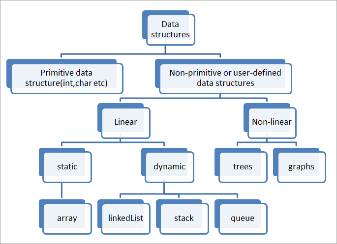
  <figcaption>Data structures hierarchy</figcaption>
</figure>

- Operations on data structures: 
    - Traversing, Searching, Inserting, Deleting, Sorting, Merging.
- **Algorithm** properties:
    - It must be correct (must produce desired output).
    - It is composed of a series of concrete steps.
    - There can be no ambiguity.
    - It must be composed of a finite number of steps.
    - It must terminate.
- To summarize:
    - **Problem** - a function of inputs and mapping them to outputs.
    - **Algorithm** - a step-by-step set of operations to solve a specific problem or a set of problems.
    - **Program** - a specific sequences of instructions in a prog. lang., and it may contain the implementation of many algorithms.

### Abstract data type
- https://youtu.be/ZniDyolzrBw, https://youtu.be/n0e27Cpc88E
- Two important things about data types:
  - Defines a certain **domain** of values
  - Defines **operations** allowed on those values
  - Example: `int` takes
    - Takes only integer values
    - Operations: addition, subtraction, multiplication, division, bitwise operations.
- ADT describes a set of objects sharing the same properties and behaviors.
    - The *properties* of an ADT are its data.
    - The *behaviors* of an ADT are its operations or functions.
- ADT example: stack (can be implemented with array or linked list)
- **Abstraction** is the method of hiding the unwanted information.
- **Encapsulation** is a method to hide the data in a single entity or unit along with a method to protect information from outside. Encapsulation can be implemented using by access modifier i.e. private, protected and public.

### What is the data structure
- A **data structure** is the organization of the data in a way so that it can be used efficiently.
- It is used to implement an ADT.
- ADT tells us *what* is to be done and data structures tells use *how* to do it.
- Types:
  - **linear** (stack, array, linked list)
  - **non-linear** (tree, graph)
  - **static** (compile time memory allocation), array
    - Advantage: fast access
    - Disadvantage: slow insertion and deletion
  - **dynamic** (run time memory allocation), linked list
    - Advantage: faster insertion and deletion
    - Disadvantage: slow access

### Asymptotic notations
- Efficiency measured in terms of **TIME** and **SPACE**. In terms of number of operations.
- Asymptotic complexity 
    - The running time depends on the *size of the input* 
    - `f(n)` = running time of an algorithm, where `n`= input size. We are interested in growth of `n` to calculate the `f(n)`
    - "Functions do more work for bigger input"
    - Drop all constants: `3n, 5n, 100n => n`, [why?](https://www.youtube.com/watch?v=MgyLGVUn8LQ)
    - Ignore lower order terms: n<sup>3</sup> + n<sup>2</sup> + n + 5 => n<sup>3</sup>
    - Ignore the base of logs: `log(2) => ln(2)`
- f(n) = O(n<sup>2</sup>) => describes how f(n) grows in comparison to n<sup>2</sup>
- Big-O notation, Ω (Omega) notation, Θ (Big-Theta) notation
- Big-O notation is used to measure the performance of any algorithm by providing the order of growth of the function.
- 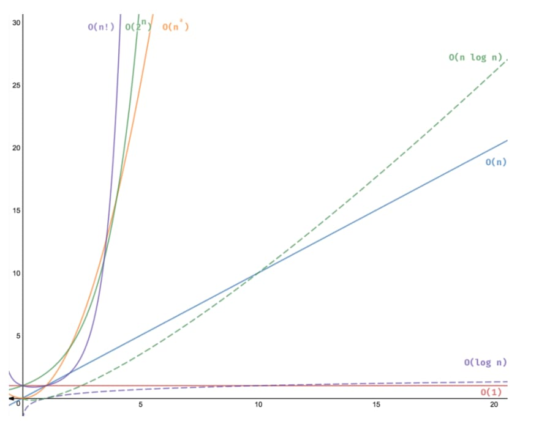
- <a href="https://youtu.be/vsgrJrphEHo">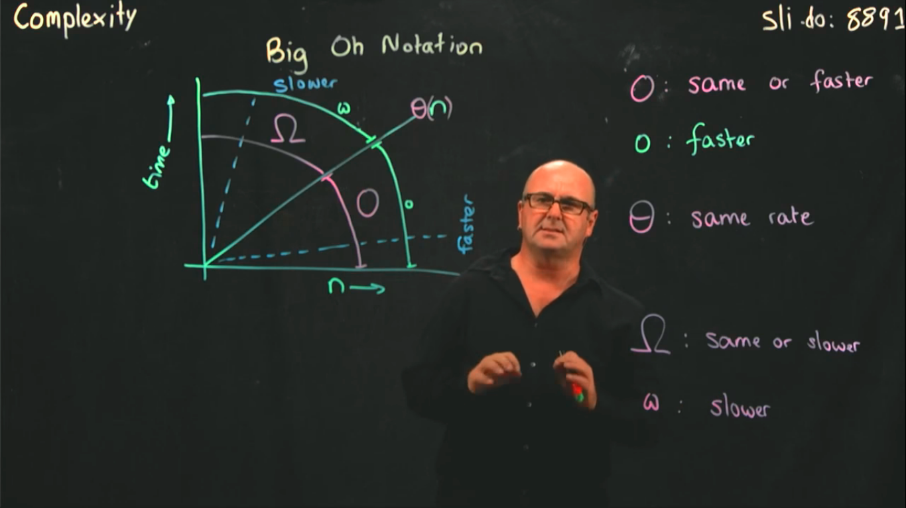</a>
- 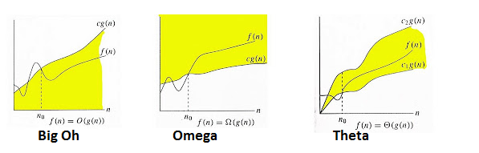
- **O (Big-O) notation** (worst time, upper bound, maximum complexity), `0 <= f(n) <= c*g(n) for all n >= n0`, `f(n) = O(g(n))`
    ```
    f(n) = 3n + 2, g(n) = n, f(n) = Og(n)

    3n + 2 <= Cn
    3n + 2 <= 4n
    n >= 2

    c = 4, n >= 2
    ```
   - n<sup>3</sup> = O(n<sup>2</sup>) False
   - n<sup>2</sup> = O(n<sup>3</sup>) True
- **Ω (Omega) notation**  (best amount of time, lower bound), `0 <= c*g(n) <= f(n) for all n >=n0`
     ```
    f(n) = 3n + 2, g(n) = n, f(n) = Ωg(n)

    3n + 2 <= Cn
    3n + 2 <= n
    2n >= -2
    n >= -1

    c = 1, n >= 1
    ```
- **Θ (Big-theta) notation** (average case, lower & upper sandwich), `0 <= c1*g(n) <= f(n) <= c2*g(n)`
    ```
    f(n) = 3n + 2, g(n) = n, f(n) = Θg(n)

    C1*n <= 3n + 2 <= C2*n

    3n + 2 <= C2*n            c1*n <= 3n + 2
    3n + 2 <= 4n              3n + 2 >= n
    n >= 2                    n >= -1

    c2 = 4, n >= 2            c1 = 1, n >= 1
    n >=2 // We must take greater number, which is true for both
    ```
- [Loops, if-else asymptotic analysis](https://www.youtube.com/watch?v=BpiMRyWoDu0)

    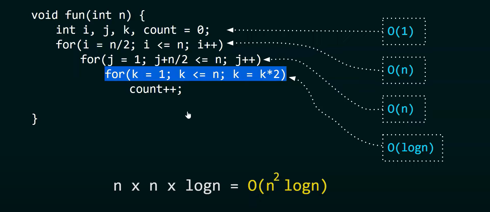
    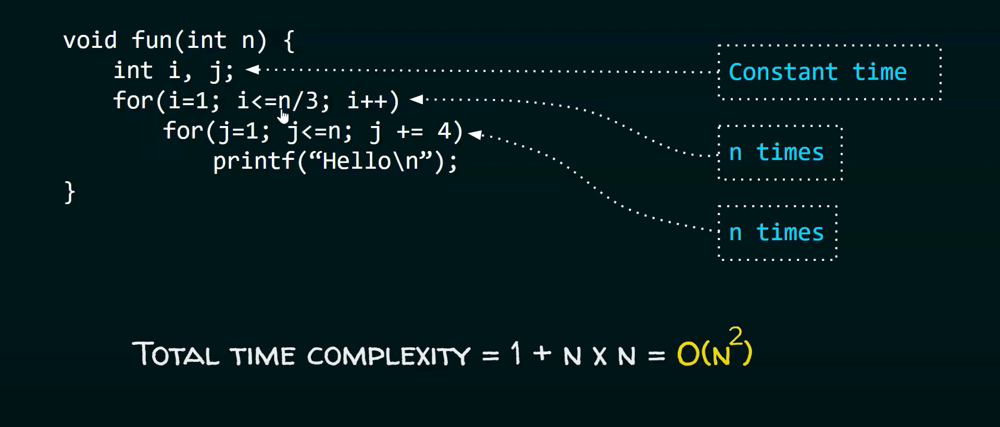

## Searching Techniques
- **Searching** is an operation which finds the location of a given element in a list.
- The search is said to be **successful** or **unsuccessful** depending on whether the element that is to be searched is found or not.

### Linear Search
- **Problem**: Given an array `arr[]` of `n` elements, write a function to search a given element `x` in `arr[]`.
-  In this type of search, a sequential search is made over all items one by one. Every item is checked and if a match is found then that particular item is returned, otherwise the search continues till the end of the data collection.
<br>
- Pseudocode:
    ```
    procedure linear_search(list, value)
        for each item in the list
            if item == value
                return the item's location
            end if
        end for
    end procedure
    ```
- <a href="code/01_linear_search.cpp">Linear search in C++</a> | <a href="code/01_linear_search.py">Linear search in Python</a>
- Analysis:
    - Best case `O(1)`
    - Average `O(n)`
    - Worst `O(n)`

### Binary Search
- Binary Search is a searching algorithm for finding an element's position in a **sorted array**.
- It's fast and efficient, tIme complexity of binary search: `O(log n)`
- In this method:
    - To search an element we compare it with the element present at the center of the list. If it matches then the search is successful.
    - Otherwise, the list is divided into two halves:
        - One from 0th element to the center element (first half)
        - Another from center element to the last element (second half)
    - The searching will now proceed in either of the two halves depending upon whether the element is greater or smaller than the center element.
    - If the element is smaller than the center element then the searching will be done in the first half, otherwise in the second half.
- It can be done recursively or iteratively.
- Pseudocode:
    ```
    procedure binary_search
        A ← sorted array
        n ← size of array
        x ← value to be searched

        set lowerBound = 1
        set upperBound = n 

        while x not found
            if upperBound < lowerBound 
                EXIT: x does not exists.
        
            set midPoint = lowerBound + (upperBound - lowerBound) / 2
            
            if A[midPoint] < x
                set lowerBound = midPoint + 1
                
            if A[midPoint] > x
                set upperBound = midPoint - 1 

            if A[midPoint] = x 
                EXIT: x found at location midPoint
        end while
    
    end procedure
    ```
- <a href="code/02_binary_search.cpp">Binary search in C++</a> | <a href="code/02_binary_search.py">Binary search in Python</a> 
- Analysis:
    - Best-case `O(1)` 
    - Average `O(log n)` 
    - Worst-case `O(log n)`

## Sorting techniques
- **Sorting** - a process of arranging a set of data in certain order
- **Internal sorting** - deals with data in memory of computer
- **External sorting** - deals with data stored in data files when data is in large volume
- Types of sorts:
  - [Selection sort](https://www.programiz.com/dsa/selection-sort) - O(n<sup>2</sup>). Selects the smallest element from an unsorted list and places that element in front. [Python code](code/selection_sort.py)
  - [Bubble sort](https://www.programiz.com/dsa/bubble-sort) - best O(n) else O(n<sup>2</sup>). Compares adjacent elements, and swaps elements bringing large elements to the end. [Python code](code/bubble_sort.py)
  - **[Insertion sort](https://www.programiz.com/dsa/insertion-sort) - best O(n) else O(n<sup>2</sup>). Places unsorted element at its suitable place in each iteration. [Python code](code/insertion_sort.py)
  - **[Merge sort](https://www.programiz.com/dsa/merge-sort) - O(n\*logn). It is based on *Divide and Conquer Algorithm* divides in the middle, sorts, then combines.
  - [Quick sort](https://www.programiz.com/dsa/quick-sort) - **PIVOT**, worst O(n<sup>2</sup>) else O(n\*logn). Based on *Divide and Conquer Algorithm*, larger and smaller elements are placed after and before pivot element.
  - [Heap sort](https://www.programiz.com/dsa/heap-sort) - O(n\*logn).
  - Radix sort
  - Bucket sort
- 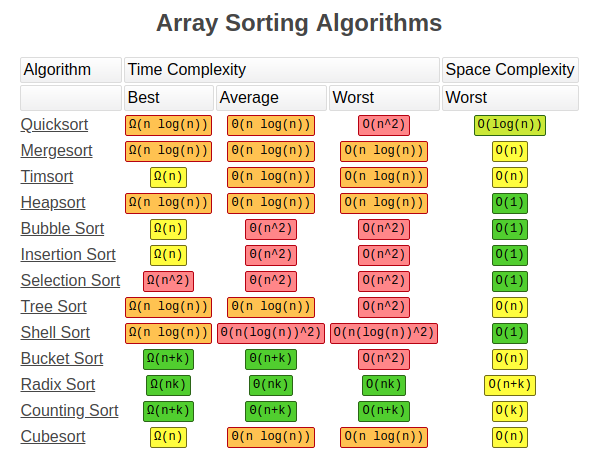

### [Merge sort](https://www.programiz.com/dsa/merge-sort) 
- [Python code](code/merge_sort.py)
- Problem is divided into two sub-problems. Each problem is solved individually. Finally, sub-problems are combined to final solution.
- Divide: we split `A[p..r]` into two arrays `A[p..q]` and `A[q+1, r]`
- Conquer: we sort both sub-arrays `A[p..q]` and `A[q+1, r]`, so this part is recursive. We use merge sort to sort both sub-arrays.
- Combine: we combine the results by creating a sorted array `A[p..r]` from two sorted sub-arrays `A[p..q]` and `A[q+1, r]`
<br>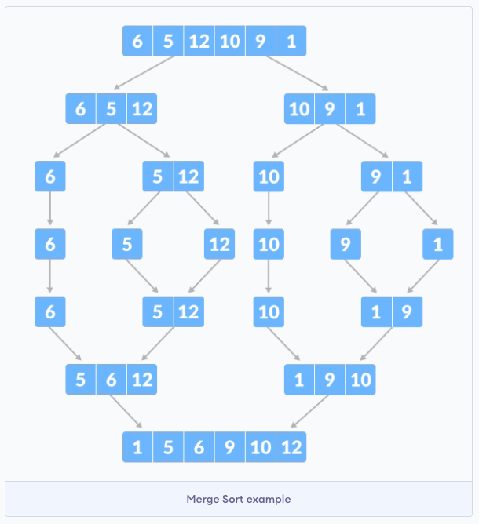
- How do we merge (combine)? We need to two pointers i, j to track current position in sub-arrays. Basically, we are placing the mim value to final array.
<br>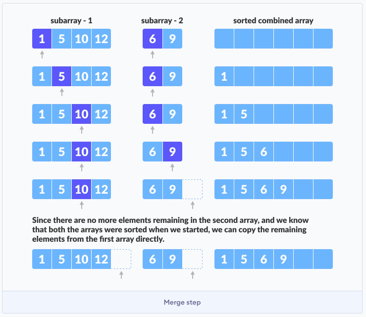

### [Quick sort](https://www.programiz.com/dsa/quick-sort) 
- [Python code](code/quick_sort.py)
- Based on divide and conquer approach.
- Algorithm:
  - An array is divided into sub-arrays by selecting a **pivot element** (element selected from the array).
  - While dividing the array, the pivot element should be positioned in such a way that elements less than pivot are kept on the left side and elements greater than pivot are on the right side of the pivot.
  - The left and right sub-arrays are also divided using the same approach. This process continues until each subarray contains a single element.
  - At this point, elements are already sorted. Finally, elements are combined to form a sorted array
- Working with Quicksort algorithm:
  1. Select the pivot element. We select the rightmost element of array as pivot element.
  <br>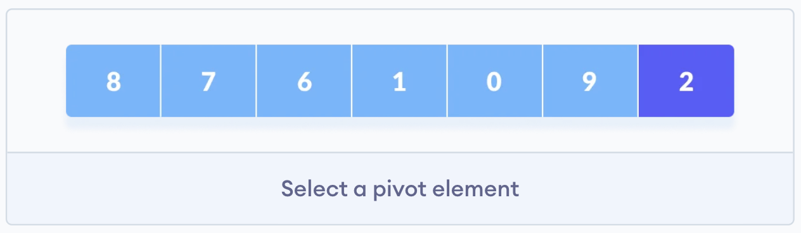
  2. Rearrange the array. We rearrange smaller and larger elements to right and left side of pivot. 
  <br>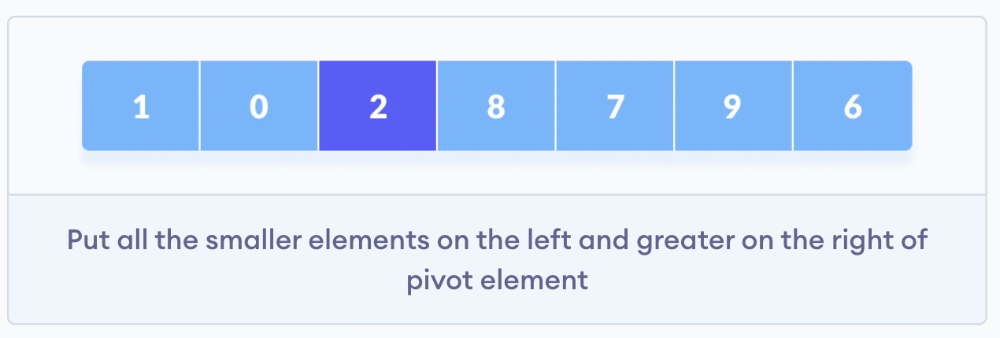
  3. How do we rearrange the array? 
     1. We need PIVOT which is last element, "i" the first largest element from left side, and "j" which is the iterator (next element in array). 
     2. We compare "j" with pivot. If "j" is smaller than pivot we swap "j" with "i", and make "++i".
     3. If "j" reaches the pivot, we just swap pivot with "i".
     4. Now we have two sub-arrays, we repeat the same algo.

### [Heap sort](https://www.programiz.com/dsa/heap-sort)
- [Python code](code/heap_sort.py)
- Left child of element `i` is `2i + 1`, right child is `2i + 2`. Indexing starts from 0
- Parent of element `i` can be found with `(i-1) / 2`
- Heap data structure:
    - It is a complete binary tree (nodes are formed from left to right)
    - All nodes are greater than children (max-heap)
    - 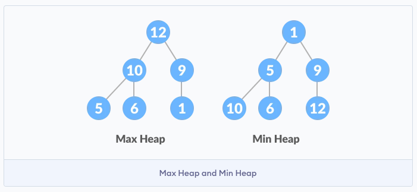
- To create a Max-Heap from a complete binary tree, we must use a `heapify` function.
    - 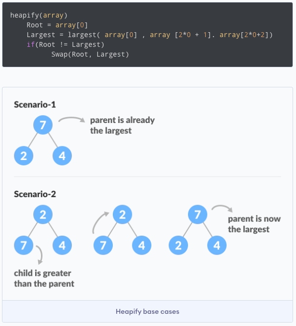
    - `n/2 - 1` is the first index of a non-leaf node.
    - Heapify function, which bring larger element in top. Used just for one sub-tree recursively.
      ```c
      void heapify(int arr[], int n, int i) {
        // Find largest among root, left child and right child
        int largest = i;
        int left = 2 * i + 1;
        int right = 2 * i + 2;
        
        if(left < n && arr[left] > arr[largest])
        largest = left;
        
        if(right < n && arr[right] > arr[largest])
            largest = right;
        
        // Swap and continue heapifying if root is not largest
        if (largest != i) {
            swap(&arr[i], &arr[largest]);
            heapify(arr, n, largest);
        }
      }
      ```
  
    - Firstly, it is a kind of pre-condition for swapping, we must bring our tree to MAX-HEAP, so that the largest element is in top. It is needed so that we start sorting the array.
      ```c
      // Max-heap creation
      for(int i = n/2 - 1; i >= 0; i--)
          heapify(arr, n, i);
      ```
    - After that we swap elements, and apply heapify again.
      ```c 
       // Build heap (rearrange array)
       for (int i = n/2 - 1; i >= 0; i--)
            swap(arr[i], arr[0]);
            heapify(arr, n, i);
      ```

## Linked List
- Array limitations:
    - Fixed size
    - Physically stored in consecutive memory locations
    - To insert or delete items, may need to shift data
- Variations of linked list: linear linked list, circular linked list, double linked list
- **head** pointer "defines" the linked list (it is not a node)<br>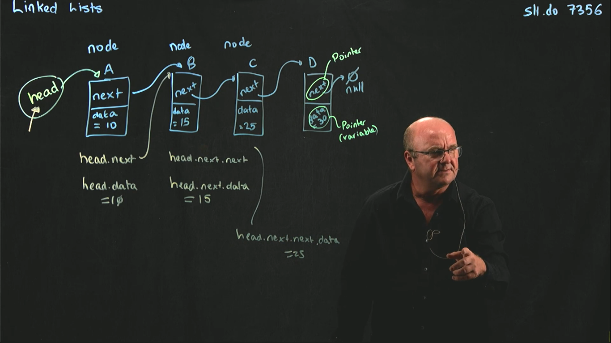
- Advantages of **Linked Lists**
    - The items do NOT have to be stored in consecutive memory locations.
        - So, can insert and delete items without shifting data.
        - Can increase the size of the data structure easily.
    - Linked lists can grow dynamically (i.e. at run time) – the amount of memory space allocated can grow and shrink as needed.
- Disadvantages of **Linked Lists**
    - A linked list will use more memory storage than arrays. It has more memory for an additional linked field or next pointer field.
    - Linked list elements cannot randomly be accessed.
    - Binary search cannot be applied in a linked list.
    - A linked list takes more time in traversing of elements.
- **Node**
    - A linked list is an ordered sequence of items called **nodes**
    - A node is the basic unit of representation in a linked list
    - A node in a singly linked list consists of two fields:
        - A *data* portion
        - A *link (pointer)* to the *next* node in the structure
    - The first item (node) in the linked list is accessed via a front or head pointer
        - The linked list is defined by its head (this is its starting point)
- We will use `ListNode` and `LinkedList` classes (https://youtu.be/Dfu7PeZ3v2Q)
  ```cpp
  class Node {
      public:
          int info; // data
          Node* next; // pointer to next node in the list
          /*Node(int val) {info = val; next=NULL;}*/
  };
  
  class List {
      public:
          // head: a pointer to the first node in the list. 
          // Since the list is empty initially, head is set to NULL
          List(void) {head = NULL;} // constructor
          ~List(void);			  // destructor
      
      private:
          Node* head;
  };
  // isEmpty, insertNode, findNode, deleteNode, displayList
  ```
- Boundary condition 
    - Empty data structure
    - Single element in the data structure
    - Adding / removing beginning of data structure
    - Adding / removing end of data structure
    - Working in the middle

### Insertion at beginning in Linked List
- https://youtu.be/yMoHuOZzMpk
- It is just a 2-step algorithm:
    - `New node` should be connected to the `first node`, which means the head. This can be achieved by assigning the address of node to the head.
    - `New node` should be considered as a `head`. It can be achieved by declaring head equals to a new node.
```cpp
void insertStart(int val) { 
    Node *node = new Node; // create a new node (node=node)
    node->info=val; // put value

    if(head == NULL) { // check if the list is empty
        head = node; 
        node->next = NULL
    }
    else { // if list is not empty
        node->next = head; 
        head = node; 
    }
}
```

### Insertion at the end in Linked List
```cpp
void insertEnd(int val) {
    Node *node = new Node; // create a new node
    node->info = val; // put value
    node->next = NULL; // pointer of last node is NULL 

    if(head == NULL) { // if empty
        node->next = NULL
        head = node;
    }
    else { 
        Node *cur = new Node();
        cur = head;
        while(cur->next != NULL) {
            cur = cur->next;
        }
        cur->next = node;
    }
}
```
### Insertion at particular position
- In this case, we don’t disturb the `head` and `tail` nodes. Rather, a new node is inserted between two consecutive nodes. 
- We call one node as `current` and the other as `previous`, and the new node is placed between them.
- Two steps we need to insert between `previous` and `currect`:
    - Pass the address of the new node in the next field of the previous node.
    - Pass the address of the current node in the next field of the new node.
    ```cpp
    void insertPosition(int pos, int val) {
        Node *pre; 
        Node *cur; 
        Node *node = new Node;

        node->data = val; 
        cur = head; 

        for(int i=1; i<pos; i++) {
            pre = cur; 
            cur = cur->next; 
        } 
        pre->next = node; 
        node->next = cur; 
    }
    ```
    ```cpp
    void insertSpecificValue(int sp_val, int data) {     
        Node *pre; 
        Node *cur; 
        Node *node = new Node;

        node->info = data; 
        cur = head; // "current" in the beginning points to head, and "previous" points to NULL

        while(cur->data != sp_val) {
            pre = cur; 
            cur = cur->next; 
        } 
        node->next = cur;            
        cur->next = node; 
    }
    ```

### Deleting the first node from a Linked List
- Following steps, we need to remove the first node:
    - Check if the linked list exists or not `if(head == NULL)`.
    - Check if it is one element list.
    - However, if there are nodes in the linked list, then we use a pointer variable `PTR` that is set to point to the first node of the list. For this, we initialize `PTR` with Head that stores the address of the first node of the list. 
    - Head is made to point to the next node in sequence and finally the memory occupied by the node pointed by PTR is freed and returned to the free pool.
    ```cpp
    void deleteFirst() {
        if(head == NULL) { // if empty
            cout << "Underflow" << endl;
        }
        else if(head.next == NULL) { // if only one element
            Node *ptr;
            ptr = head;
            head = NULL;
            delete ptr;
        }
        else { // otherwise
            Node *ptr;
            ptr = head;
            head = head->next;
            delete ptr;
        }
    }
    ```

### Deleting the last node from a Linked List
- Following steps we need to remove the first node:
    - Check if the linked list exists or not `if(head == NULL)`.
    - Check if it is one element list.
    - Take a pointer variable `PTR` and initialize it with `head`. That is, `PTR` now points to the first node of the linked list. In the while loop, we take another pointer variable `PREPTR` such that it always points to one node before the PTR. Once we reach the last node and the second last node, we set the NEXT pointer of the second last node to NULL, so that it now becomes the (new) last node of the linked list. The memory of the previous last node is freed and returned back to the free pool.
    ```
    STEP 1: IF START = NULL
            WRITE UNDERFLOW
            Go to STEP 8
            [END OF IF]
    STEP 2: SET PTR = START
    STEP 3: REPEAT Steps 4 and 5 while PTR->NEXT != NULL
    STEP 4:     SET PREPTR = PTR
    STEP 5:     SET PTR = PTR->NEXT
            [END OF LOOP]
    STEP 6: SET PREPTR->NEXT = NULL
    STEP 7: FREE PTR
    STEP 8: EXIT
    ```

### Deleting the Specific Node in a Linked List
```
Step 1: IF START = NULL
        Write UNDERFLOW Go to Step 10
        [END OF IF]
Step 2: SET PTR = START
Step 3: SET PREPTR = PTR
Step 4: Repeat Steps 5 and 6 while PREPTR-> DATA I = NUM
Step 5: SET PREPTR = PTR
Step 6: SET PTR = PTR -> NEXT
        [END OF LOOP)
Step 7: SET TEMP = PTR
Step 8: SET PREPTR -> NEXT - PTR-> NEXT
Step 9: FREE TEMP
Step 10: EXIT
```

## Circular Linked List
- https://youtu.be/7ELt4-z4YeI
- In a circular linked list, the last node contains a pointer to the first node. 
- No node points to NULL!
- Start at `head`, iterate until you find `head` again: `t == head, t.next == head`
- Complexity for all operations is `O(n)`
-   ```cpp
    class  Node {
        int info;
        Node *next;
    };

    class CircularLList {
        public:
            Node *last;

        CircularLList() {
            last = NULL;
        }
    };
    ```

### Insertion at Beginning in Circular Linked List
```cpp
void addBegin(int val) {
    Node *temp = new Node();
    temp->info=val;

    if (last == NULL) { // if empty
        last = temp;
        temp->next = last; // points next to itself // in simple LL it pointed to NULL
    }
    else {
        temp->next = last;
        last = temp;
    }

```

### Insertion at the End in Circular Linked List
```cpp
while cur->next != last) {
    cur = cur->next;
}
cur->next = New;
New->next = last; 
```

### Insertion at Particular Position in Circular Linked List 
```cpp
void insertNode(int item,int pos) {
    Node *New = new Node();
    Node *prev;
	Node *cur;
	New->data = item;    

	if(last == NULL){	// insert into empty list
		last = New;
		last->next = last;
   	}

	prev = last;
	cur = last->next;

	for (int i=1; i<pos; i++) {
        prev = cur;
	    cur = cur->next;
	} 	

    New->next = cur;	
	prev->next = New;
}
```

### Deletion a Node in Circular Linked List
- From a single-node circular linked list (node points to itself):
    ```cpp
    last = NULL;
    delete cur;
    ```
- Delete the head node:
    ```cpp
    while(prev->next != last) {
        prev = cur; 
        cur = cur->next;
    }
    prev->next = cur->next;	
    delete cur;
    ```
- Delete a middle node Cur:
    ```cpp
    for(i=1; i<=pos; i++) {
        prev = cur; 
        cur = cur->next;
    }
    prev->next = cur->next;
    delete cur;
    ```
- Delete the end node:
    ```cpp
    while(cur->next != last) { 
        prev = cur; 
        cur = cur->next;
    }
    prev->next = cur->next;   
    delete cur;
    ```
## Doubly Linked List
- https://youtu.be/v8xyoI11PsU
- DLL contains a pointer to the next as well as the previous node in the sequence. Therefore, it consists of three parts:
    - data
    - a pointer to the next node
    - a pointer to the previous node
-   ```cpp
    class Node {
        int info;
        Node *next;
        Node *pre;
    }
    ```

## Stacks
- Last in, first out (LIFO)
- Elements are added to and removed from the top of the stack (the most recently added items are at the top of the stack).
-  
- Operations on Stack:
    - `push(i)`	to insert the element `i` on the top of the stack.
    - `pop()` to remove the top element of the stack and to return the removed element as a function value.
    - `top()` to return the top element of stack(s)
    - `empty()` to check whether the stack is empty or not. It returns true if stack is empty and returns false otherwise.

### Array Representation of Stacks
- In the computer’s memory, stacks can be represented as a linear array.
- Every stack has a variable called TOP associated with it, which is used to store the address of the topmost element of the stack.
- TOP is the position where the element will be added to or deleted from
- There is another variable called MAX, which is used to store the maximum number of elements that the stack can hold.
- Underflow and Overflow:
	- if `TOP = NULL` (underflow) it indicates that the stack is empty and 
    - if `TOP = MAX–1` (overflow) then the stack is full.
- Pseudocode for PUSH, POP, PEEK:
    ```
    PUSH operation
    Step 1: IF TOP = MAX - 1
            PRINT "OVERFLOW" 
            Goto Step 4
            [END OF IF]
    Step 2: SET TOP = TOP + 1
    Step 3: SET STACK[TOP] = VALUE
    Step 4: END

    POP operation
    Step 1: IF TOP = NULL
            PRINT "UNDERFLOW"
            Goto Step 4 
            [END OF IF]
    Step 2: SET VALUE STACK(TOP) 
    Step 3: SET TOP = TOP - 1
    Step 4: END

    PEEK operation
    Step 1: IF TOP = NULL
            PRINT "STACK IS EMPTY"
            Goto Step 3
    Step 2: RETURN STACK[TOP]
    Step 3: END
    ```

### Linked Representation of Stack
- Stack may be created using an array. This technique of creating a stack is easy, but the drawback is that the array must be declared to have some fixed size. 
- In a linked stack, every node has two parts—one that stores data and another that stores the address of the next node. The START pointer of the linked list is used as TOP.
- **PUSH** is adding a node at beginning, **POP** deleting front node.

### Infix to Postfix
- Algorithm used (Postfix):
    - Step 1: Add `)` to the end of the infix expression
    - Step 2: Push `(` onto the STACK
    - Step 3: Repeat until each character in the infix notation is scanned
        - IF a `(` is encountered, `push` it on the STACK.
        - IF an `operand` (whether a digit or acharacter) is encountered, `add` it postfix expression.
        - IF a `)` is encountered, then
            - a. Repeatedly `pop` from STACK and `add` it to the postfix expression until a `(` is encountered.
            - b. Discard the `(`. That is, remove the `(` from STACK and do not add it to the postfix expression
        - IF an operator `O` is encountered, then
            - a. Repeatedly `pop` from STACK and `add` each operator (popped from the STACK) to the postfix expression which has the **same precedence or ahigher precedence than O**
            - b. `Push` the operator to the STACK
        [END OF IF]
    - Step 4: Repeatedly `pop` from the STACK and `add` it to the postfix expression until the STACK is empty
    - Step 5: EXIT
- If `/` adds to `((-*` we will take only `*`, then it will be `((-/`
    ```
    Example: (A * B) + (C / D) – (D + E)

    (A * B) + (C / D) – (D + E))    [put extra ")" at last]

    Char	Stack	    Expression
    (	    ((	        Push at beginning "("
    A	    ((	        A
    *	    ((*	        A
    B	    ((*	        AB
    )	    (	        AB*
    +	    (+	        AB*
    (	    (+(	        AB*
    C	    (+(	        AB*C
    /	    (+(/        AB*C
    D	    (+(/        AB*CD
    )	    (+	        AB*CD/
    -	    (-	        AB*CD/+
    (	    (-(         AB*CD/+
    D	    (-(         AB*CD/+D
    +	    (-(+        AB*CD/+D
    E	    (-(+        AB*CD/+DE
    )	    (-          AB*CD/+DE+
    )                   AB*CD/+DE+-
    ```

### Evaluation of Postfix expression
-   ```
    [AB*CD/+DE+-] ==> 2 3 * 2 4 / + 4 3 + -

    Char    Stack	Operation
    2	    2	
    3	    2, 3	
    *	    6           2*3
    2	    6, 2	
    4	    6, 2, 4 	
    /	    6, 0        2/4
    +	    0	        6+0
    4	    6, 4	
    3	    6, 4, 3	
    +	    6, 7        4+3
    -	    -1	        6-7
    ```

### Infix to Prefix

#### First method
- Algorithm used (Prefix): 
    - Step 1. `Push` `)` onto STACK, and `add` `(` to start of the A.
    - Step 2. Scan A from right to left and repeat step 3 to 6 for each element of A until the STACK is empty or contain only `)`
    - Step 3. If an **operand** is encountered add it to B
    - Step 4. If a **right parenthesis** is encountered push it onto STACK
    - Step 5. If an **operator** is encountered then:
        - a. Repeatedly pop from STACK and add to B each operator (on the top of STACK) which has **only higher precedence than the operator**.
        - b. Add operator to STACK
    - Step 6. If **left parenthesis** is encountered then
        - a. Repeatedly pop from the STACK and add to B (each operator on top of stack until a right parenthesis is encountered)
        - b. Remove the left parenthesis
    - Step 7. **Reverse** B to get prefix form

-   ```
    Example: 14 / 7 * 3 - 4 + 9 / 2

    (14 / 7 * 3 - 4 + 9 / 2 [Put extra "(" to start]

    Char	Stack	    Expression
    2	    )	        Push at beginning ")"
    /	    )/	        2
    9	    )/	        2 9
    +	    )+	        2 9 /
    4	    )+	        2 9 / 4
    -	    )+-	        2 9 / 4
    3	    )+-	        2 9 / 4 3
    *	    )+-*        2 9 / 4 3
    7	    )+-*        2 9 / 4 3 7
    /	    )+-*/       2 9 / 4 3 7
    14	    )+-*/       2 9 / 4 3 7 14
    (                   2 9 / 4 3 7 14 / * - +

    DON'T FORGET TO REVERSE: + - * / 14 7 3 4 / 9 2
    ```

#### Second method 
- Algorithm used (Prefix): 
    - Step 1: Reverse the infix string. Note that while reversing the string you must interchange left and right parentheses. Eg. `(3+2)` will be `(2+3)` but not `)2+3(`
    - Step 2: Obtain the postfix expression of the infix expression obtained in Step 1.
    - Step 3: Reverse the postfix expression to get the prefix expression

-   ```
    Example: 14 / 7 * 3 - 4 + 9 / 2

    Reversed: 2 / 9 + 4 - 3 * 7 / 14

    Char	Stack	    Expression
    2	    (	        Push at beginning "("
    /	    (/	        2
    9	    (/	        2 9
    +	    (+	        2 9 /
    4	    (+	        2 9 / 4
    -	    (+-	        2 9 / 4
    3	    (+-	        2 9 / 4 3
    *	    (+-*        2 9 / 4 3
    7	    (+-*        2 9 / 4 3 7
    /	    (+-*/       2 9 / 4 3 7
    14	    (+-*/       2 9 / 4 3 7 14
    )                   2 9 / 4 3 7 14 / * - +

    DON'T FORGET TO REVERSE: + - * / 14 7 3 4 / 9 2

    NOTE: Operator with the same precedence must not be popped from stack
    ```

### Evaluation of Prefix Expression
- For postfix we eveluated `a+b` but in prefix we will do `b+a`

-   ```
    Example: 14 / 7 * 3 - 4 + 9 / 2 ==> + - * / 14 7 3 4 / 9 2

    Char	Stack	            Operation
    2       2	
    9       2, 9	
    /       4	                9/2 [but in postfix we did 2/9]
    4       4, 4 	
    3       4, 4, 3	    
    7       4, 4, 3, 7
    14      4, 4, 3, 7, 14
    /       4, 4, 3, 2          14/2  
    *       4, 4, 6             2*2
    -       4, 2                6-4
    +       6                   2+4
    ```

## Queue
- First in, first out (FIFO)
- The queue has a **front** and a **rear**
    - 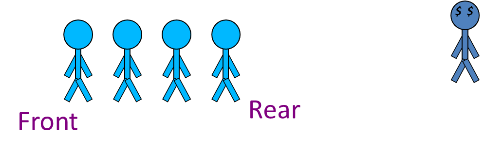
    - Items can be removed only at the **front**
    - Items can be added only at the ohter end, the **rear**
- Types of queues:
    - Linear queue
    - Circular queue
    - Double ended queue (Deque)
    - Priority queue

### Linear Queue
- A queue is a sequence of data elements
- **Enqueue** (add element to back) when an item is `inserted` into the queue, it always goes `at the end` (rear). 
- **Dequeue** (`remove` element from front) when an item is taken from the queue, it always comes `from the front`. 
- Implemented using either array or a linear linked list.
- Array implementation:
    - **ENQUEUE**
        ```
        Step 1: IF REAR = MAX-1 
                    Write "OVERFLOW"
                    Goto step 4
                [END OF IF]
        Step 2: IF FRONT = -1 and REAR = -1
                    SET FRONT = REAR = 0
                ELSE
                    SET REAR = REAR + 1
                [END OF IF]
        Step 3: SET QUEUE [REAR] = NUM
        Step 4: EXIT
        ```
    - **DEQUEUE**
        ```
        Step 1: IF FRONT = -1 OR FRONT > REAR
                    Write "UNDERFLOW"
                ELSE
                    SET VAL = QUEUE[FRONT]
                    SET FRONT = FRONT + 1  
                [END OF IF]
        Step 2: EXIT
        ```

- Linked list implementation:
    - **ENQUEUE** the same as adding a node at the end
        ```
        Step 1: Allocate memory for the new node and name it as PTR
        Step 2: SET PTR -> DATA = VAL
        Step 3:
            IF FRONT = NULL
                SET FRONT = REAR = PTR
                SET FRONT -> NEXT = REAR -> NEXT = NULL
            ELSE
                SET REAR -> NEXT = PTR
                SET REAR = PTR
                SET REAR -> NEXT = NULL
            [END OF IF]
        Step 4: END

        ```
    - **DEQUEUE** the same as deleting a node from the beginning
        ```
        Step 1: IF FRONT = NULL
                    Write "Underflow"
                    Go to Step 5
                [END OF IF]

        Step 2: SET PTR = FRONT
        Step 3: SET FRONT = FRONT -> NEXT
        Step 4: FREE PTR
        Step 5: END
        ```

### Circular Queue
- https://youtu.be/ihEmEcO2Hx8
- **Drawbacks of linear queue** once the queue is full, eventhough few elements from the front are deleted and some occupied space is relieved, it is not possible to add anymore new elements, as the rear has already reached the Queue’s rear most position.  
- In circular queue, once the Queue is full the "First" index of the Queue becomes the "Rear" most index, if and only if the "Front" element has moved forward. Otherwise it will  be  a "Queue overflow" state. <br>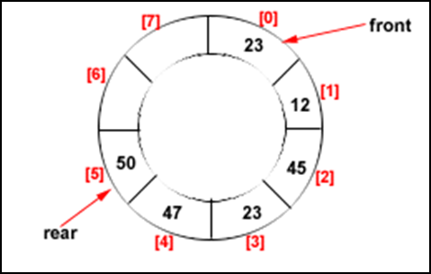
-  **ENQUEUE** algorithm:
    ```
    Insert-Circular-Q(CQueue, Rear, Front, N, Item)

    1.  If Front = -1 and Rear = -1:
            then Set Front :=0 and go to step 4

    2.  If Front = 0 and Rear = N-1 or Front = Rear + 1:
            then Print: “Circular Queue Overflow” and Return

    3.  If Rear = N -1:
            then Set Rear := 0 and go to step 4

    4.  Set CQueue [Rear] := Item and Rear := Rear + 1 

    5.  Return
    ```
    - Here, `CQueue` is a circular queue.
    - `Rear` represents the location in which the data element is to be inserted.
    - `Front` represents the location from which the data element is to be removed.  
    - `N` is the maximum size of CQueue 
    - `Item` is the new item to be added. 
    - Initailly `Rear = -1` and `Front = -1`.

- **DEQUEUE** algorithm:
    ```
    Delete-Circular-Q(CQueue, Front, Rear, Item)

    1. If Front = -1: 		
            then Print: “Circular Queue Underflow” and Return

    2. Set Item := CQueue [Front]

    3. If Front = N – 1: 	
            then Set Front = 0 and Return

    4. If Front = Rear:		
            then Set Front = Rear = -1 and Return

    5. Set Front := Front + 1 

    6. Return
    ```
    - `CQueue` is the place where data are stored. 
    - `Rear` represents the location in which the data element is to be inserted. 
    - `Front` represents the location from which the data element is to be removed. 
    - `Front` element is assigned to `Item`. 
    - Initially, `Front = -1`.

- While insert `REAR++`, `FRONT`
- While delete `REAR`, `FRONT++`
- If `FRONT = REAR + 1` then queue is full! Overflow will occur.

### Double Ended Queue
- It is exactly like a queue except that elements can be added to or removed from the **head** or the **tail**.
- No element can be added and deleted from the middle. 
- Implemented using either a circular array or a circular doubly linked list.
- In a deque, two pointers are maintained, `LEFT` and `RIGHT`, which point to either end of the deque. 
- The elements in a deque extend from the `LEFT` end to the `RIGHT` end and since it is circular, `Deque[N–1]` is followed by `Deque[0]`.
- Two types:
    - **Input restricted deque** In this, insertions can be done only at one of the ends, while deletions can be done from both ends.
    - **Output restricted deque** In this deletions can be done only at one of the ends, while  insertions can be done on both ends.
- 

### Priority Queue
- A priority queue is a data structure in which each element is assigned a priority.
- The priority of the element will be used to determine the order in which the elements will be processed. 
- An element with *higher priority* is processed before an element with a *lower priority*.
- Two elements with the same priority are processed on a first-come-first-served (FCFS) basis.

## Tree
- **Root**: node without parent (A)
- **Siblings**: nodes share the same parent
- **Internal node**: node with at least one child (A, B, C, F)
- **External node** (leaf): node without children (E, I, J, K, G, H, D)
- **Ancestors** of a node: parent, grandparent, grand-grandparent, etc.
- **Descendant** of a node: child, grandchild, grand-grandchild, etc.
- **Depth** of a node: number of ancestors
- **Height** of a tree: maximum depth of any node (3)
- **Degree of a node**: the number of its children. The leaf of the tree does not have any child so its degree is zero
- **Degree of a tree**: the maximum degree of a node in the tree.
- **Subtree**: tree consisting of a node and its descendants
- **Empty (Null)-tree**: a tree without any node
- **Root-tree**: a tree with only one node
- 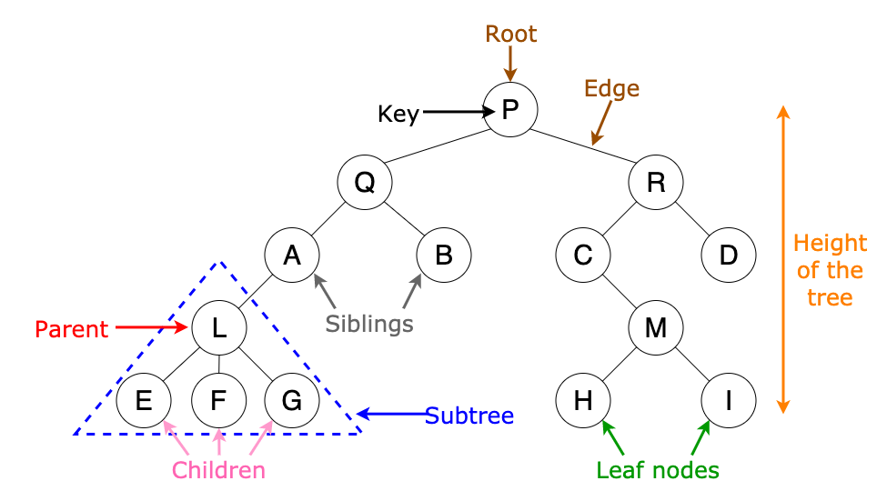

## Binary Tree
- https://youtu.be/0k1gZ7m8WUk
- It is a data structure that is defined as a collection of elements called nodes.
- In a binary tree, 
    - The topmost element is called the root node.
    - Each node has 0, 1, or at the most 2 children. 
    - A node that has zero children is called a leaf node or a terminal node. 
    - Every node contains a data element, a left pointer which points to the left child, and a right pointer which points to the right child
- **Complete binary tree** - every level except possibly the last is completely filled. All nodes must appear as far left as possible.
    - 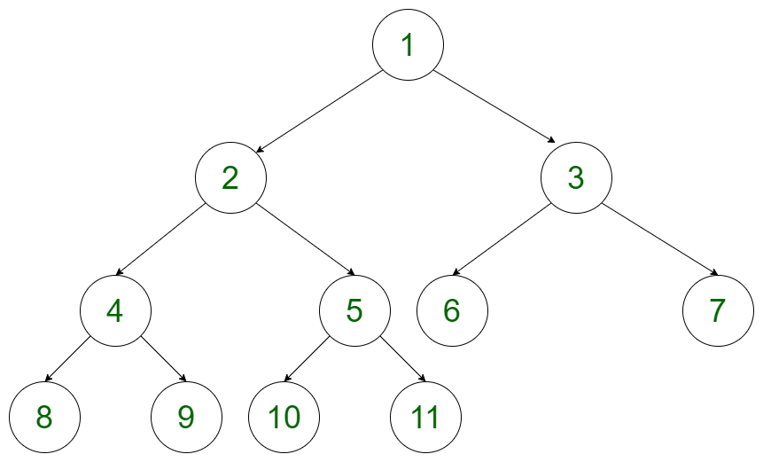

- Linked list implementation of binary tree:
    - Every node will have three parts: the **data element**, **a pointer to the left node**, and **a pointer to the right node**. 

        ```cpp
        class Node {
            public: 
                Node *left;
                int data;
                Node *right;
        };
        ```
    - Every binary tree has a pointer `ROOT`, which points to the root element (topmost element) of the tree. If `ROOT = NULL`, then the tree is **empty**.

- Array implementation of binary treee:
    - If `TREE[1] = ROOT` then
        - the left child of a node `K` ==> `2*K`
        - the right child of a node `K` ==> `2*K+1`
        - parent of any node `K` ==> `floor(K/2)` 
        - max size of tree is 2<sup>h+1</sup>-1, where h = height
        - P.S. floor(3/2) = 2
    
    - If `TREE[0] = ROOT` then
        - the left child of a node `K` ==> `2*K+1`
        - the right child of a node `K` ==> `2*K+2`
        - parent of any node `K` ==> `floor(K/2)-1`

- Algebraic expressions with binary tree
    - `((a + b) – (c * d)) % ((f ^ g) / (h – i))` 

    - 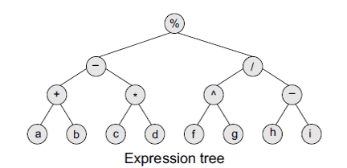

### Traversing a Binary Tree 
- https://youtu.be/H0exHo7KAhQ
- PREORDER (NLR), POSTORDER (LRN) & INORDER TRAVERSAL (LNR)
- Preorder traversal can be used to extract a prefix notation
- 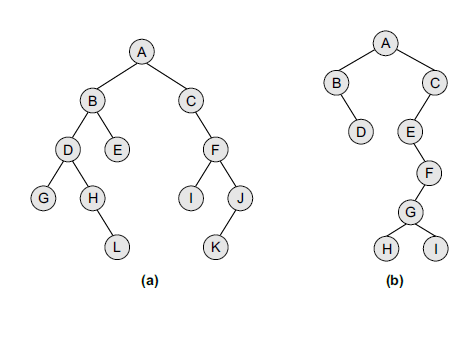
- **PREORDER TRAVERSAL** (NLR)
    1. Visiting the root node,
    2. Traversing the left sub-tree, and finally
    3. Traversing the right sub-tree.

        ```
        Example outputs with preorder:
        (a) A, B, D, G, H, L, E, C, F, I, J, K
        (b) A, B, D, C, E, F, G, H, I
        ```
- **POSTORDER TRAVERSAL** (LRN)
    1. Traversing the left sub-tree,
    2. Visiting the root node, and finally
    3. Traversing the right sub-tree.

        ```
        Example outputs with postorder:
        (a) G, L, H, D, E, B, I, K, J, F, C, A
        (b) D, B, H, I, G, F, E, C, A
        ```
- **INORDER TRAVERSAL** (LNR)
    1. Traversing the left sub-tree,
    2. Traversing the right sub-tree, and finally
    3. Visiting the root node.

        ```
        Example outputs with inorder:
        (a) G, D, H, L, B, E, A, C, I, F, K, J
        (b) B, D, A, E, H, G, I, F, C
        ```

## Binary Search Tree
- **A binary search tree**, also known as an ordered binary tree, is a variant of binary trees in which the nodes are arranged in an order.
- Left sub-tree nodes must have a value less than that of the root node.
- Right sub-tree must have a value either equal to or greater  than the root node.
- `O(n)` worst case for searching in BST

### Search & Insert Operation in Binary Search Tree
- 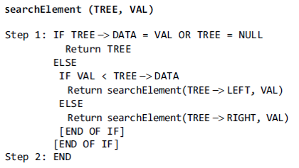
- 
- Insert `39,27,45,18,29,40,9,21,10,19,54,59,65,60` in binary search tree
    <br>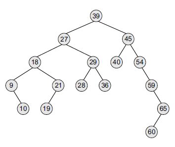

### Deletion Operation in Binary Search Tree
- Deleting a `Node` that has no children, `delete 78` <br>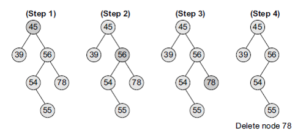
- Deleting a `Node` with One Child, `delete 54`<br>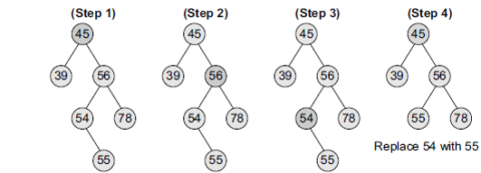
- Deleting a `Node` with Two Children, `delete 56`<br>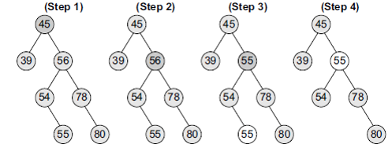
- Main algorithm: <br>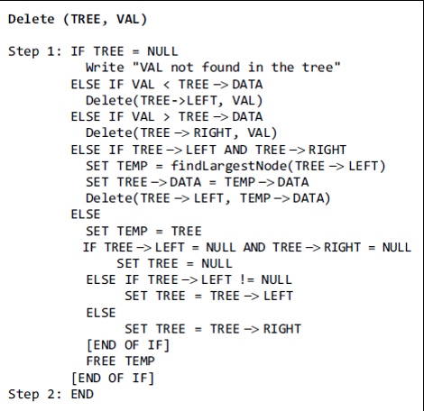

## Graphs
- **Vertices** (nodes), **edges** (lines between vertices), undericted graph, directed graph
- Adjacent nodes and neighbors:
    ```
    O----O adjacent nodes
    ```
- **Degree of a node** - Total number os edges containing the node. If deg(u)=0 then **isolated node**.
- **Size of a graph** - The size of a graph is the total number of edges in it.

- **Regular graph** - It is a graph where each vertex has the same number of neighbors. That is, every node has the same degree. <br>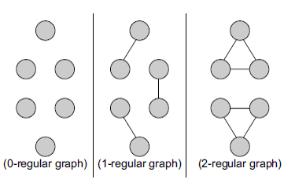
- **Connected graph** - A graph is said to be connected if for any two vertices (u, v) in V there is a path from u to v. That is to say that there are `no isolated nodes` in a connected graph. <br>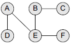
- **Complete graph** - Fully connected. That is, there is a `path from one node to every other node` in the graph. A complete graph has `n(n–1)/2` edges, where n is the number of nodes in G. <br>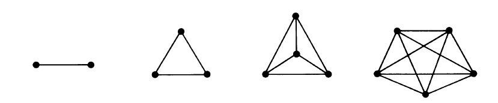
- **Weighted graph** - In a weighted graph, the edges of the graph are assigned some weight or length. <br>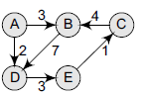
- **Multi-graph** - A graph with multiple edges and/or loops is called a multi-graph. <br>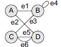

- **Directed Graphs** - *digraph*, a graph in which every edge has a direction assigned to it. <br>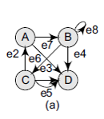
- Terminology of a Directed graph:
    - *Out-degree of a node* - The out-degree of a node u, written as outdeg(u), is the number of edges that **originate** at u.
    - *In-degree of a node* - The in-degree of a node u, written as indeg(u), is the number of edges that **terminate** at u.
    - *Degree of a node* - The degree of a node, written as deg(u), is equal to the sum of in-degree and out-degree of that node. 
    Therefore, `deg(u) = indeg(u) + outdeg(u)`.
    - *Isolated vertex* - A vertex with degree zero. Such a vertex is not an end-point of any edge.
    - *Pendant vertex* - (also known as leaf vertex) A vertex with degree one.

- **REPRESENTATION OF GRAPHS**. Sequential (adjacency matrix) & linked rep-s.
    - 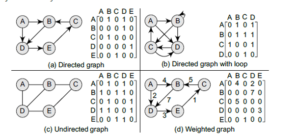
    - 
    - 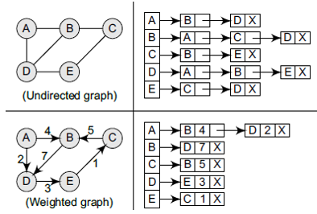

### Breadth First Search Traversal
- There are two standard methods of graph traversal: 
    1. Breadth-first search (uses queue)
    2. Depth-first search (uses stack)
- https://youtu.be/oDqjPvD54Ss
- Breadth-first search. Complexity = `O(vertices + edges)`, finding the shortest path on unweighted graphs.
- BFS starts at some arbitrary node of a graph and explores the neighbour nodes first, before moving to the next level neighbours.
- 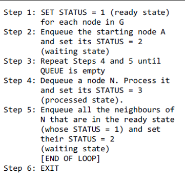

### Depth First Search
- https://youtu.be/7fujbpJ0LB4
- Complexity = `O(vertices + edges)`
- Make sure you don't re-visit visited nodes! Continue on the previous node!
- Backtrack when a dead end is reched! Means don't take the node which has no other neighbours.
- 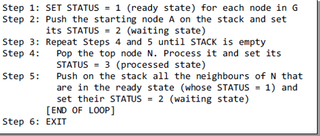
- Choose any arbitrary node and PUSH (STATUS 2) it into stack. Then only we will POP. When you POP (STATUS 3) and PUSH neighbours.

## Threaded Binary Tree
- According to this idea we are going to replace all the null pointers by the appropriate pointer values called threads.
- The maximum number of nodes with height `h` of a binary tree is 2<sup>h+1</sup>-1
- `n0` is the number of leaf nodes and `n2` the number of nodes of degree 2, then `n0=n2+1`

### Inorder Traversal in TBT
- `A / B * C * D + E`
<br>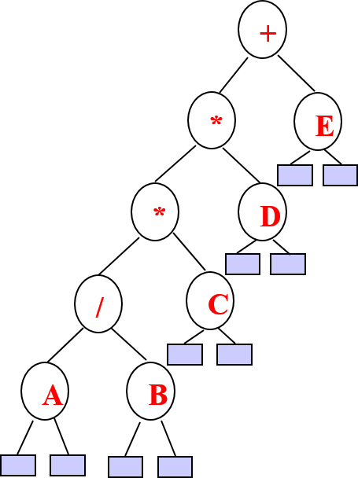  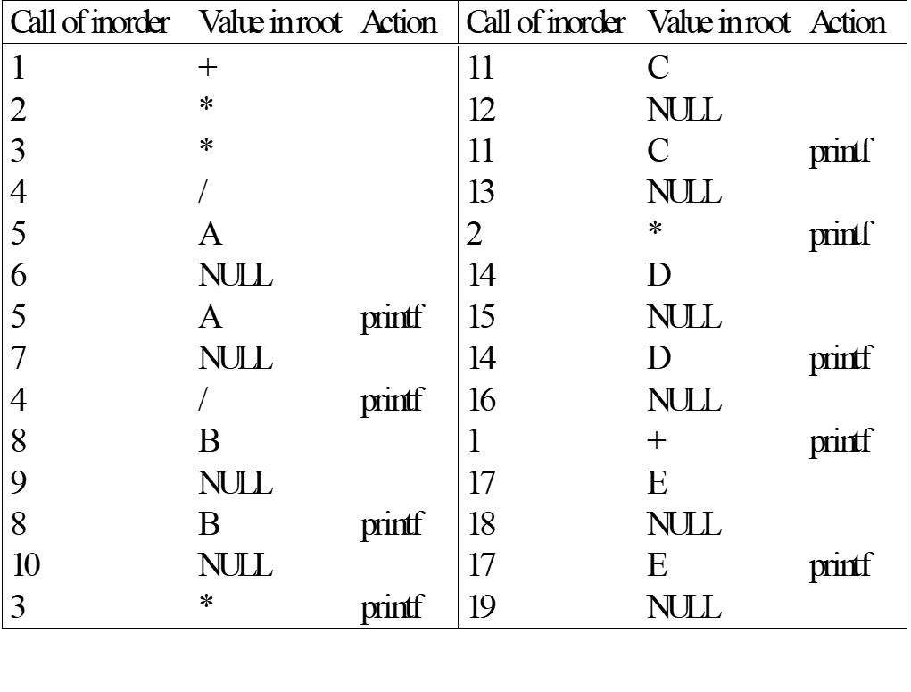
- `n`: number of nodes
- number of non-null links: `n-1`
- total links: `2n`
- null links: 2n-(n-1)=`n+1`
- Replace these null pointers with some useful “threads”.
- A one-way threading and a two-way threading exist.

### Threaded Binary Tree One-Way
- In the one way threading of T, 
a thread will appear in the **right field** of a node and will point to the next node in the in-order traversal of T.
- 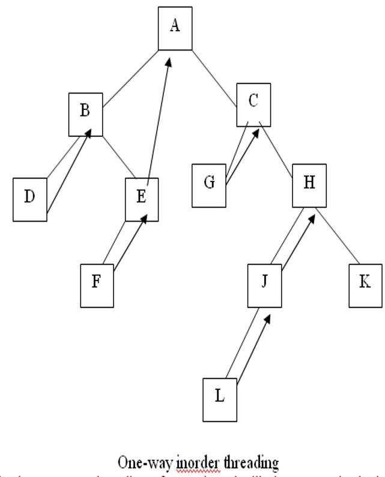

### Threaded Binary Tree Two-Way 
- If `ptr->left_child` is `null`, replace it with a pointer to the node that would be *visited before ptr* in an inorder traversal (**inorder predeccessor**)
- If `ptr->right_child` is `null`, replace it with a pointer to the node that would be *visited after ptr* in an inorder traversal (**inorder successor**)
- 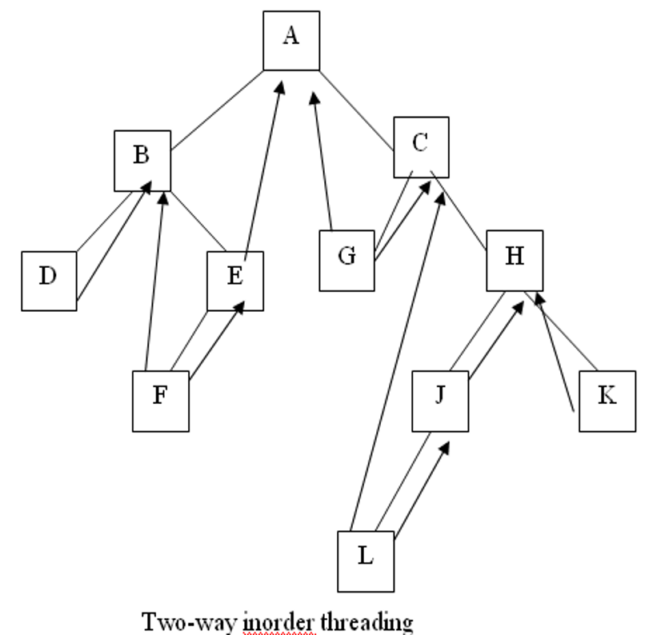
- ```cpp
  class Node {
    int data;
    Node *left_child, *right_child;
    boolean leftThread, rightThread;
  }
  ```
- 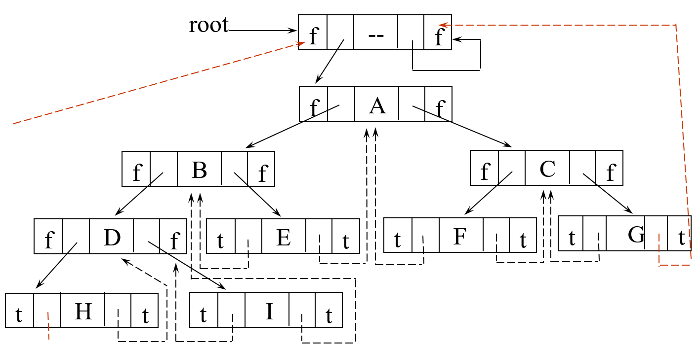

### Inserting Node in TBT
- Inserting in the right side <br>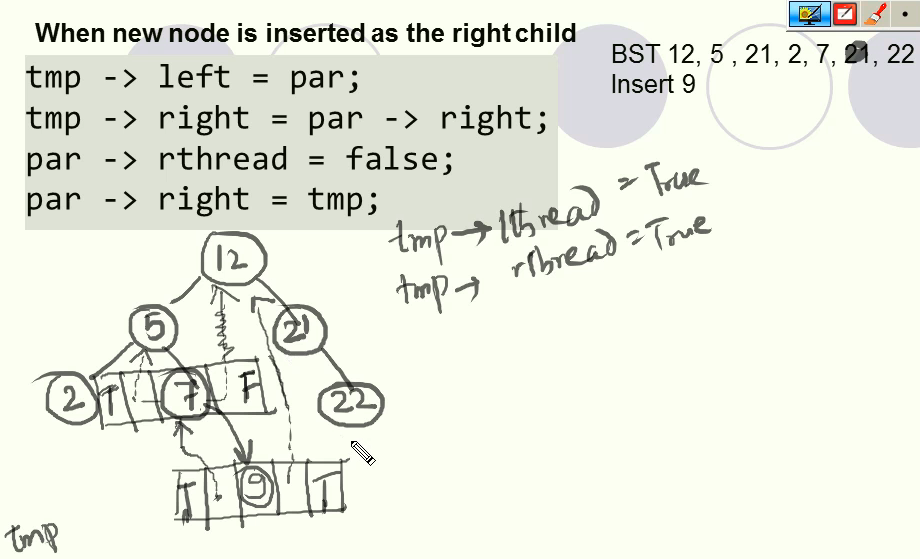
- Inserting in the left side <br>

## AVL Trees
- https://youtu.be/1QSYxIKXXP4
- Adelson-Velsky-Landis - one of many types of Balanced Binary Search Tree. `O(log(n))`
- **Balanced Factor (BF)**: `BF(node) = HEGHT(node.right) - HEIGH(node.left)`
- Where `HEIGHT(x)` is the hight of node `x`. Which is the **number of edges** between `x` and the **furthest leaf**.
- -1, 0, +1 balanced factor values.

### Insertion in AVL Tree
- 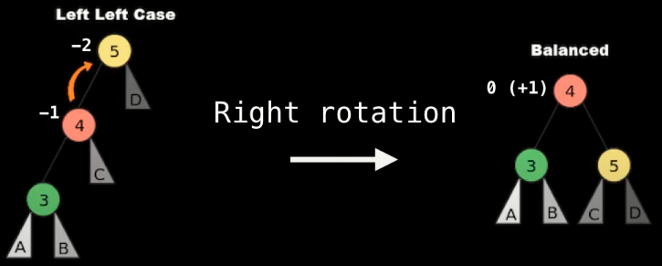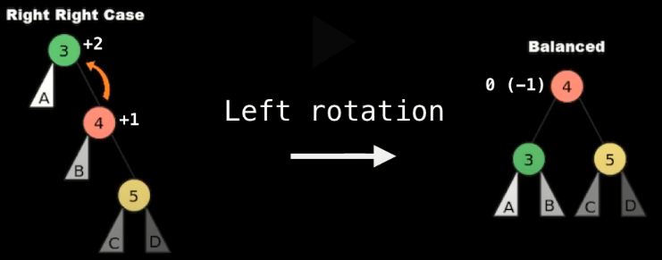
- 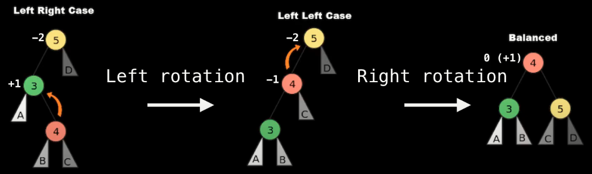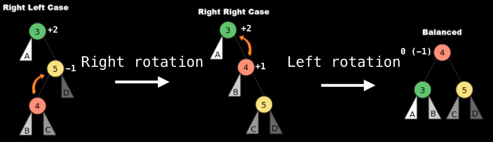
- 
- 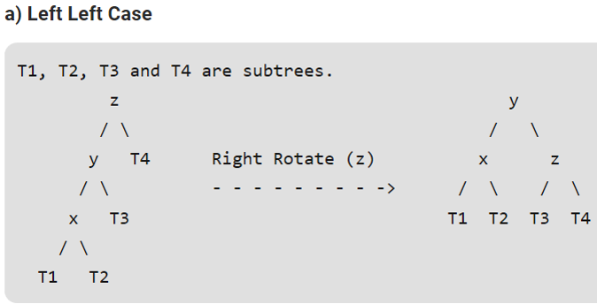
- 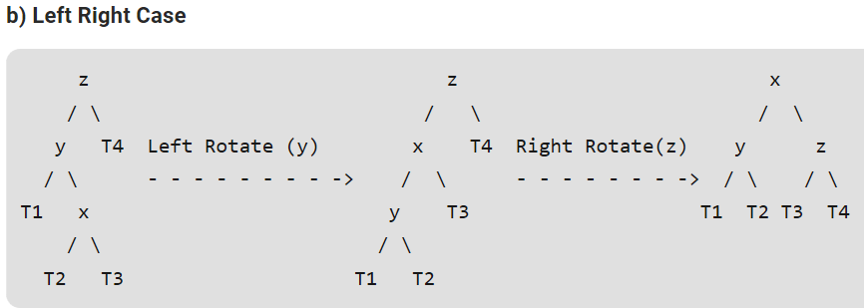
- 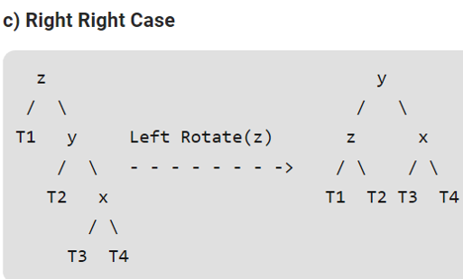
- 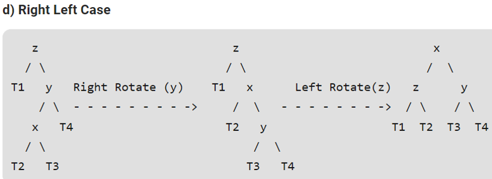
- **Examples**:
    - 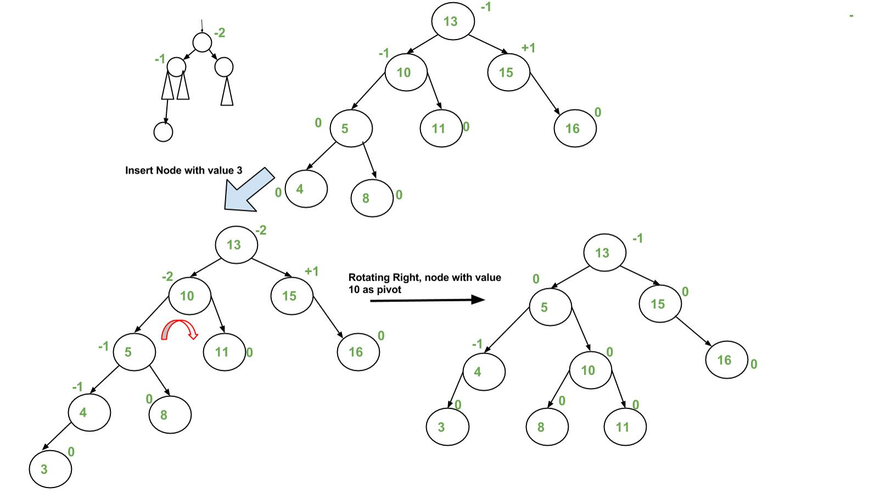
    - 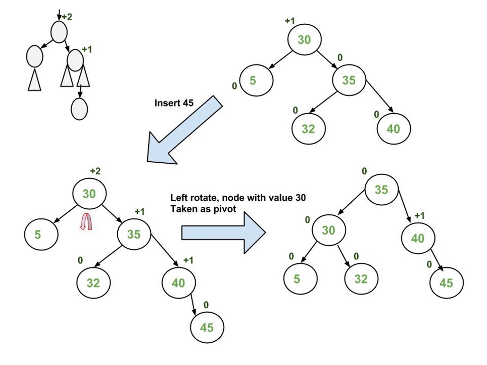
    - 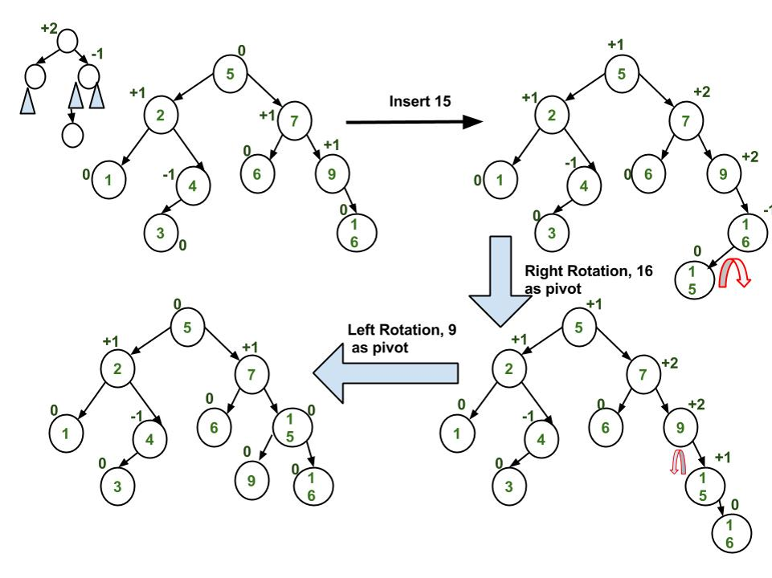

### Deletion in AVL Tree
- We need rebalancing if needed after deletion: **L rotation** & **R rotation**
- R rotations
    - R0 -> LL Case
    - R1 -> LL case
    - R-1 -> LR case
- L rotations
    - L0 -> RR Case
    - L1 -> RL Case
    - L-1 -> RR Case
- Example R0:<br>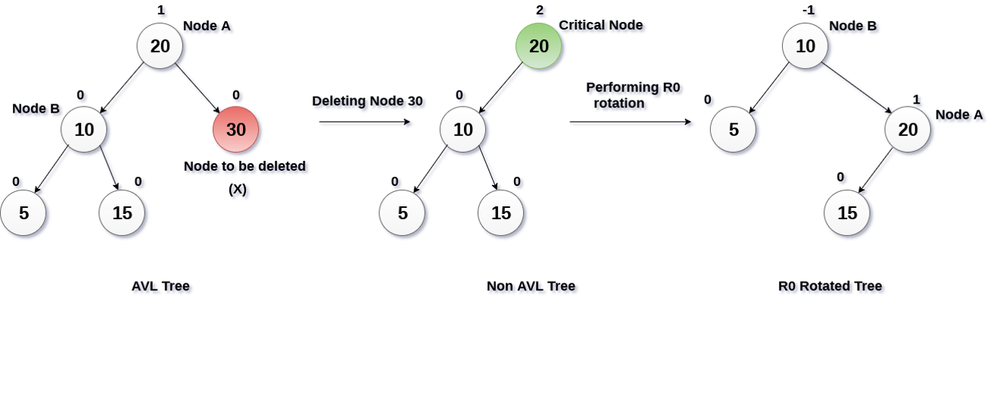
- Example R1:<br>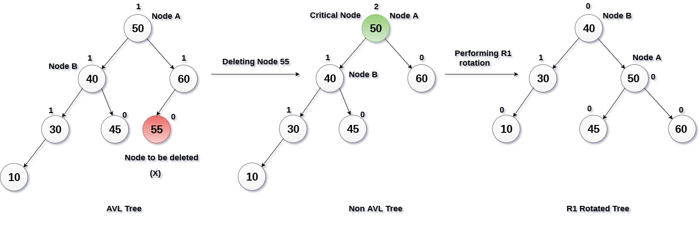
- Example R-1:<br>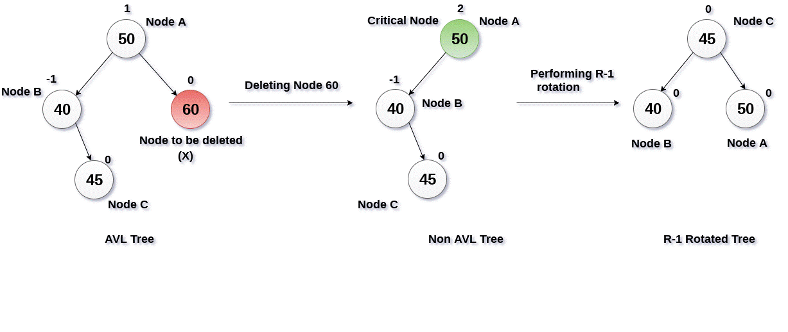

## Huffman Encoding
- Fixed-Length encoding 
- Variable-Length encoding 
- **Prefix rule** - used to prevent ambiguities during decoding which states that no binary code should be a prefix of another code.
    - ```
      Bad       Good
      a 0       a 0
      b 011     b 11     
      c 111     c 101
      d 11      d 100
      ```
- **Algorithm for creating the Huffman Tree**: 
    - Step 1- Create a leaf node for each character and build a min heap using all the nodes (The frequency value is used to compare two nodes in min heap)
    - Step 2- Repeat Steps 3 to 5 while heap has more than one node
    - Step 3- Extract two nodes, say x and y, with minimum frequency from the heap
    - Step 4- Create a new internal node z with x as its left child and y as its right child. Also f`requency(z)= frequency(x)+frequency(y)`
    - Step 5- Add z to min heap
    - Step 6- Last node in the heap is the root of Huffman tree

- 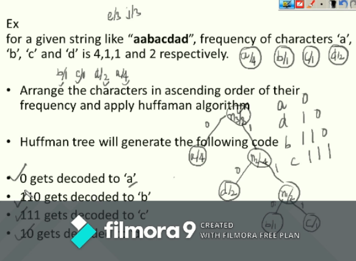

## M-way trees
- http://faculty.cs.niu.edu/~freedman/340/340notes/340multi.htm
- Binary search tree is the binary tree.
- Each node has `m` children and `m-1` key fields. The keys in each node are in ascending order.
- A binary search tree has *one value* in each node and *two subtrees*. This notion easily generalizes to an **M-way search tree**, which has `(M-1)` values per node and `M` subtrees. 
- M is called the **degree** of the tree. A binary search tree, therefore, has degree 2. 
- M is thus a *fixed upper limit* on how much data can be stored in a node. 

## B-Trees
- http://faculty.cs.niu.edu/~freedman/340/340notes/340multi.htm
- Every node in a B-Tree contains at most m children. (other nodes beside root & leaf must have at least m/2 children)
- All leaf nodes must be at the same level.
- **Inserting**
    - Find the appropriate leaf node
    - If the leaf node contain less than m-1 keys then insert the element in the increasing order.
    - Else if the leaf contains m-1:
        - Insert the new element in the increasing order of elements.
        - Split the node into the two nodes at the median.
        - Push the median element upto its parent node.
        - If the parent node also contain m-1 number of keys, then split it too by following the same steps.
